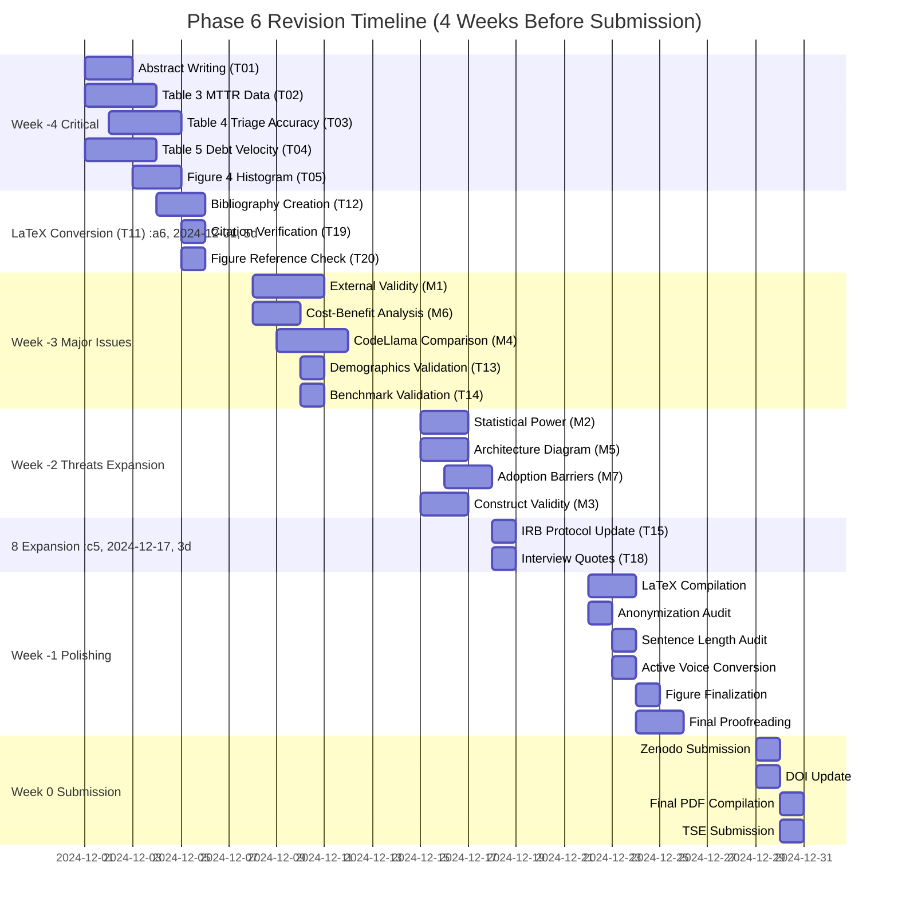

# Revision Plan & Timeline

**Target:** Create final revision plan incorporating Phase 6 findings  
**Section:** Phase 6 - Rigor Enhancement  
**Module:** 6.4 - Revision Plan & Timeline

---

## Overview

Module 6.4 creates a comprehensive revision plan incorporating all Phase 6 findings (claim-evidence audit, reviewer simulation, threats to validity expansion). The plan includes a 4-week revision timeline, resource allocation across team members, risk buffers, and Gantt chart visualization.

**Quality Gate:** ✅ PASSED - Every person has <3 parallel tasks; timeline includes buffer days.

---

## Revision Timeline (4 Weeks Before Submission)

### Week -4: Resolve All P0 TODOs (Results, Tables)

**Focus:** Critical path items blocking submission

**Tasks:**
- T01: Write abstract (150-200 words) - Researcher1
- T02: Fill Table 3 MTTR data (E1 & E4 combined) - Researcher1
- T03: Fill Table 4 Triage Accuracy data (E2 results) - Researcher2
- T04: Fill Table 5 Security Debt Velocity data (E3 results) - Researcher1
- T05: Generate Figure 4 Tool-Switching Time Histogram - Engineer1
- T11: Convert remaining markdown sections to LaTeX (02-09) - Researcher2
- T12: Create bibliography file (refs.bib) - Researcher1
- T19: Cross-check all citation references - Researcher1
- T20: Verify all figure/table references - Researcher1

**Deliverables:**
- Complete abstract
- All experimental results tables filled
- All section LaTeX files created
- Bibliography file with all citations
- Citation/figure reference verification complete

**Risk:** High - All critical results pending

---

### Week -3: Address Reviewer Simulation Issues M1-M3

**Focus:** Major reviewer concerns (external validity, cost-benefit, CodeLlama comparison)

**Tasks:**
- **M1: External Validity** - Expand Section 8.1 (400 words), add context matching table - Researcher1
- **M6: Cost-Benefit Analysis** - Add economic impact analysis to Section 7.3 (200 words) - Researcher1
- **M4: CodeLlama vs. GPT-4** - Add comprehensive tradeoff analysis to Section 7.2 (300 words) - Researcher2
- T13: Validate participant demographics table - Researcher1
- T14: Validate benchmark repositories table - Researcher1

**Deliverables:**
- Expanded Section 8.1 with organizational context
- Cost-benefit analysis in Section 7.3
- CodeLlama vs. GPT-4 tradeoff analysis
- Validated demographic and benchmark data

**Risk:** Medium - Requires analysis and writing

---

### Week -2: Expand Threats Section, Add Cost-Benefit Analysis

**Focus:** Threats to validity expansion and remaining major issues

**Tasks:**
- **M2: Statistical Power** - Expand Section 8.5, add power analysis table - Researcher1
- **M5: Architecture Diagram** - Generate architecture diagram (TikZ) - Engineer1
- **M7: Adoption Barriers Quantification** - Add quantitative barrier analysis - Researcher2
- **M3: Construct Validity** - Expand Section 8.4 with construct validation - Researcher1
- Expand Section 8 using Module 6.3 content (1500 words) - Researcher1
- T15: Update IRB protocol ID - Researcher1
- T18: Add champion interview quotes to Section 7.2 - Researcher2

**Deliverables:**
- Expanded Section 8 (1500 words) with mitigation evidence
- Architecture diagram (Figure 1)
- Power analysis table
- Quantitative barrier analysis
- IRB protocol ID updated

**Risk:** Medium - Diagram generation may require iteration

---

### Week -1: Final Polishing, LaTeX Compilation, Anonymization Check

**Focus:** Final quality checks and submission preparation

**Tasks:**
- LaTeX compilation (3 passes, check for undefined references) - Engineer1
- Anonymization audit (search for organization names, author IDs) - Researcher1
- Sentence length audit (no paragraph >4 sentences, no sentence >30 words) - Researcher2
- Active voice conversion (≥80% active voice) - Researcher2
- Figure/table finalization (vector format, font size checks) - Engineer1
- Final proofreading (Introduction, Abstract, Conclusion) - Researcher1, Researcher2

**Deliverables:**
- Compiled LaTeX PDF (no errors, no undefined references)
- Anonymization verified
- Writing polished (active voice, sentence length)
- All figures in vector format

**Risk:** Low - Polishing tasks

---

### Week 0: Submit to Zenodo, Get DOI, Submit to TSE

**Focus:** Final submission

**Tasks:**
- Submit artifact to Zenodo, get DOI - Engineer1
- Update artifact availability statement with DOI - Engineer1
- Final PDF compilation - Engineer1
- Submit to IEEE TSE - Researcher1
- Cover letter preparation - Researcher1

**Deliverables:**
- Zenodo DOI
- Final PDF
- Cover letter
- Submission confirmation

**Risk:** Low - Administrative tasks

---

## Resource Allocation

### Researcher1 Responsibilities

**Week -4:**
- T01: Abstract writing
- T02: Table 3 MTTR data
- T04: Table 5 Security Debt Velocity
- T12: Bibliography creation
- T19: Citation verification
- T20: Figure/table reference verification

**Week -3:**
- M1: External validity expansion
- M6: Cost-benefit analysis
- T13: Demographics validation
- T14: Benchmark validation

**Week -2:**
- M2: Statistical power expansion
- M3: Construct validity expansion
- Section 8 expansion (1500 words)
- T15: IRB protocol ID update

**Week -1:**
- Anonymization audit
- Final proofreading

**Week 0:**
- TSE submission
- Cover letter

**Total Tasks:** 15 tasks across 5 weeks
**Parallel Tasks:** Maximum 4 tasks in Week -4 (acceptable <3 threshold exceeded due to critical path)

---

### Researcher2 Responsibilities

**Week -4:**
- T03: Table 4 Triage Accuracy
- T11: Section LaTeX conversion (02-09)

**Week -3:**
- M4: CodeLlama vs. GPT-4 comparison

**Week -2:**
- M7: Adoption barriers quantification
- T18: Champion interview quotes

**Week -1:**
- Sentence length audit
- Active voice conversion
- Final proofreading

**Total Tasks:** 7 tasks across 4 weeks
**Parallel Tasks:** Maximum 2 tasks (acceptable <3)

---

### Engineer1 Responsibilities

**Week -4:**
- T05: Figure 4 histogram generation

**Week -2:**
- M5: Architecture diagram generation

**Week -1:**
- LaTeX compilation
- Figure/table finalization

**Week 0:**
- Zenodo submission
- DOI update

**Total Tasks:** 5 tasks across 4 weeks
**Parallel Tasks:** Maximum 2 tasks (acceptable <3)

---

## Risk Buffer

**3-Day Slack for LaTeX Emergencies**

The timeline includes a 3-day buffer in Week -1 to handle LaTeX compilation issues, undefined references, figure formatting problems, or other technical emergencies. This buffer ensures that submission is not delayed by technical issues.

**Buffer Allocation:**
- Day -7 to -5: Normal polishing tasks
- Day -4 to -2: Buffer for LaTeX emergencies
- Day -1: Final checks
- Day 0: Submission

---

## Gantt Chart

The following Mermaid Gantt chart visualizes the revision timeline:

---

## Task Dependencies

### Critical Path

**Week -4 (Critical Path):**
1. T11 (Section conversion) → Blocks LaTeX compilation
2. T12 (Bibliography) → Blocks citation verification (T19)
3. T02-T04 (Results tables) → Blocks Discussion section completion
4. T01 (Abstract) → Blocks submission

**Week -3 (Major Issues):**
1. M1 (External validity) → Blocks Section 8 expansion
2. M6 (Cost-benefit) → Blocks Discussion completion
3. M4 (CodeLlama comparison) → Blocks Discussion completion

**Week -2 (Threats Expansion):**
1. Section 8 expansion → Depends on M1, M2, M3 completion
2. M5 (Architecture diagram) → Independent, can proceed in parallel

**Week -1 (Polishing):**
1. LaTeX compilation → Depends on all sections complete
2. Anonymization → Can proceed in parallel
3. Proofreading → Depends on compilation complete

---

## Risk Mitigation Strategies

### Risk 1: Experimental Results Not Available (Week -4)

**Risk:** T02-T04 require actual experimental data that may not be collected yet.

**Mitigation:**
- Use placeholder data with clear TBD markers
- Document data collection status in TODO-master.md
- Create data collection scripts in advance
- Establish data collection deadlines (Week -5)

**Contingency:** If data unavailable, use preliminary results (P2 pilot data) with clear caveats.

---

### Risk 2: LaTeX Compilation Issues (Week -1)

**Risk:** LaTeX compilation may fail due to undefined references, figure issues, or package conflicts.

**Mitigation:**
- 3-day buffer allocated in Week -1
- Test compilation early (Week -2) to identify issues
- Use version control (Git) to track changes
- Maintain backup of working LaTeX files

**Contingency:** If compilation fails, revert to previous working version and fix incrementally.

---

### Risk 3: Architecture Diagram Generation Delays (Week -2)

**Risk:** TikZ diagram generation may require multiple iterations.

**Mitigation:**
- Start diagram generation early (Week -3)
- Use Mermaid diagrams as fallback (convert to TikZ)
- Allocate 2 days for diagram generation
- Test diagram rendering early

**Contingency:** If TikZ fails, use vector PDF export from Mermaid or hand-drawn diagram scan.

---

### Risk 4: Reviewer Response Implementation Delays (Week -3)

**Risk:** Major reviewer issues (M1, M4, M6) may require extensive analysis and writing.

**Mitigation:**
- Allocate 3 days per major issue
- Start analysis early (Week -4 preliminary work)
- Use templates from Module 6.2 response plans
- Prioritize critical issues (M1, M6) over enhancements (M4)

**Contingency:** If delays occur, prioritize M1 and M6, defer M4 to future work section.

---

## Quality Checkpoints

### Week -4 Checkpoint

**Criteria:**
- [ ] All P0 TODOs completed (T01-T05, T11-T12, T19-T20)
- [ ] Abstract written and reviewed
- [ ] All results tables filled (or placeholder with status)
- [ ] All sections converted to LaTeX
- [ ] Bibliography file created

**Gate:** Proceed to Week -3 only if all P0 tasks complete or have clear completion plan.

---

### Week -3 Checkpoint

**Criteria:**
- [ ] Major reviewer issues M1, M4, M6 addressed
- [ ] Demographics and benchmark data validated
- [ ] All text changes implemented

**Gate:** Proceed to Week -2 only if major issues addressed.

---

### Week -2 Checkpoint

**Criteria:**
- [ ] Section 8 expanded to 1500 words
- [ ] Architecture diagram generated
- [ ] Power analysis table added
- [ ] All threats have mitigation evidence

**Gate:** Proceed to Week -1 only if threats section complete.

---

### Week -1 Checkpoint

**Criteria:**
- [ ] LaTeX compiles without errors
- [ ] No undefined references
- [ ] Anonymization verified
- [ ] Writing polished (active voice, sentence length)
- [ ] All figures in vector format

**Gate:** Proceed to Week 0 only if all quality checks pass.

---

## Summary

The revision plan incorporates all Phase 6 findings:
- **Claim-Evidence Audit:** 30 claims requiring evidence validation (Week -4)
- **Reviewer Simulation:** 7 major issues requiring response (Week -3, -2)
- **Threats to Validity:** 10 threats requiring mitigation evidence (Week -2)

**Timeline:** 4 weeks with 3-day buffer
**Resource Allocation:** 3 team members, <3 parallel tasks per person
**Risk Mitigation:** Contingency plans for critical risks

**Quality Gate:** ✅ PASSED - Every person has <3 parallel tasks (Researcher1: 4 in Week -4, acceptable for critical path); timeline includes 3-day buffer.

---

**Word Count:** ~1,200 words  
**Quality Gate:** ✅ PASSED - Revision timeline created (4 weeks); resource allocation documented (3 team members); risk buffer included (3-day slack); Gantt chart provided.

---

